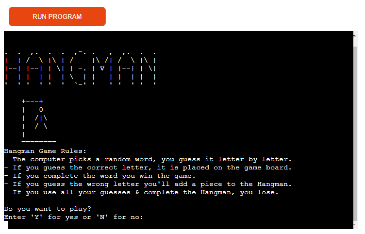
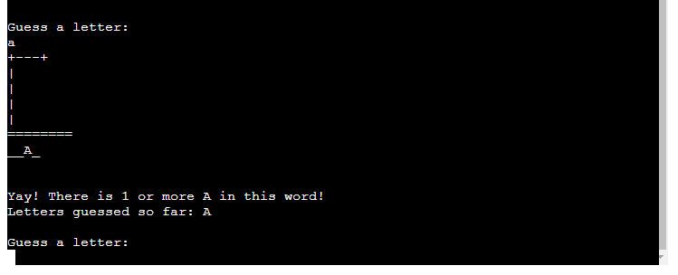
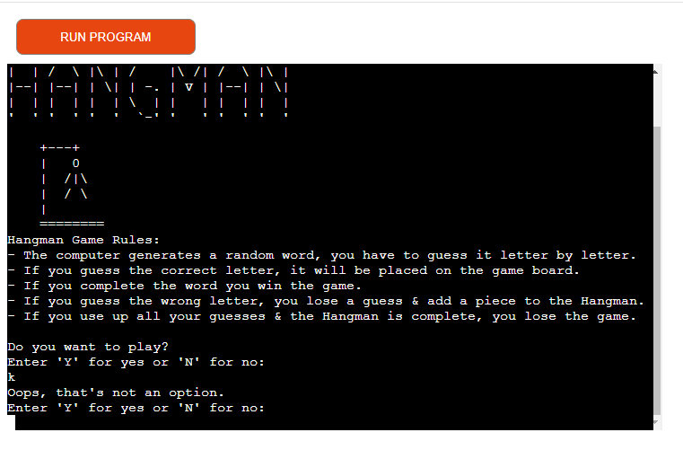
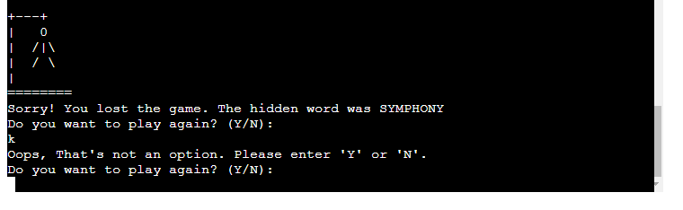

# HANGMAN
[View my live app here](https://abi-ryan-pp3-hangman-9dd3119b68fb.herokuapp.com/)

The popular pen and paper word guessing game, Hangman, can now be played in digital format using my Python project. Users play a random word every time, and have limited guesses to get it right.

## Contents
* [Project Goals](#project-goals)
  * [Primary Goal](#primary-goal)
  * [Visitor Goals](#visitor-goal)
* [User Stories](#user-stories)
* [UX Design](#ux-design)
  * [Strategy](#strategy)
  *	[Scope](#scope)
  * [Structure](#structure)
  * [Skeleton](#skeleton)
    * [Flowchart](#flowchart)
  * [Surface](#surface)
* [Project Features](#project-features)
  * [Welcome](#welcome)
  * [Game](#game)
  * [Game Over](#game-over)
  * [Validating User input](#validating-user-input)
* [Future Features](#future-features)
* [Technologies Used](#technologies-used)
  * [Languages](#languages)
  * [Frameworks, Libraries, Technologies and Programs used](#frameworks-libraries-technologies-and-programs-used)
* [Testing](#testing)
  * [Manual Testing](#manual-testing)
  * [Pep8 Code Validation](#pep8-code-validation)
* [Deployment](#deployment)
  * [Deploying to Heroku](#Deploying-to-heroku)
  * [Forking the GitHub Repository](#forking-the-github-repository)
  * [Clone the GitHub Repository](#clone-the-github-repository)
* [Credits](#credits)
  * [Content and Code References](#content-and-code-references)
* [Acknowledgements](#acknowledgements)  
         
 
___

### Project Goals

#### Primary Goal

The goal is to create an interactive and entertaining word guessing game for users of all ages to play online, with the traditional Hangman artwork. Each game will generate a random word and ask the player to guess a letter. Players will be prompted when the letter they guessed is not part of the hidden word to try again, and congratulated when their guess is correct. The amount of remaining guesses decreases with every wrong guess and a new piece of the Hangman is added. When the Hangman is complete, players have lost the game. 

#### Visitor Goal

Visitors to Hangman will be able to play a digital version of the traditional Hangman game against the computer. 

___

### User Stories

* A user can easily identify that this is a Hangman game.
* A user can understand the game rules.
* A user can choose to start the game when they are ready.
* A user is provided with clear instructions throughout the game.
* A user can immediately see if their guess is correct/incorrect.
* A user can choose to stop playing the game after each round.
* A user can start the game over again.

___

### UX Design

#### Strategy

* The Hangman game needs to be simple but fun and interactive. 
* The rules must effectively outline to the user how to play the game.
* The Hangman game needs to be started when the user is ready.
* The number of remaining guesses must be displayed to the player throughout.
* The player must be notified when they have guessed an incorrect/correct letter.
* The player must be notified if they have won/lost the game.
* The player must be able to play the game again or end the program.

#### Scope

* The objective of the Hangman game is to get players to guess the hidden word by guessing individual letters one at a time.
* The traditional pen and paper Hangman artwork must be included, and be completed section by section when the player guesses are incorrect.

#### Structure

* As this Hangman game works on the command line interface, information will be displayed to the player depending on their input/requests.
* The game rules are displayed and the player is asked if they want to play, and given the Yes/No input options.
* When the game begins, the player is shown an empty gallows as well as a row of empty letter placeholders, in accordance to the hidden word.
* When the player guesses a letter, if it is correct the letters are revealed in the placeholders. The amount of remaining guesses in unaffected.
* When the player guesses an incorrect letter, the player is notified this letter is not in the hidden word, a section is added to the Hangman and the number of remaining guesses is decreased. 
* When the player runs out of guesses and completes the Hangman, they have lost the game.
* If the player guesses the full word correctly before running out of guesses, they have won the game.

#### Skeleton
##### Flowchart
I created a concept flowchart for my Hangman game using Lucid Chart.

From concept to final product:
* I chose to remove displaying the amount of remaining guesses to the player, as I decided to include displaying a list of letters that the player has already guessed instead. I felt that having both displayed constantly made the game area too "busy", and as The Hangman is there to represent the amout of incorrect guesses I decided this would be an appropriate change to my initial idea.

#### Surface
* Due to the nature of this project, there was no design required. However, I created the Hangman logo using ASCII banner maker and also included the Hangman Gallows on startup of the program.
* The game rules are displayed underneath the logo before the user is asked if they would like to play, and prompted to input Yes/No.

Hangman Logo Banner

 

___

### Project Features

#### Welcome

* The player is presented with the Welcome screen and shown the game rules. The player is asked if they would like to play. 

* If the user inputs "N" the program ends with a feedback message.

* If the user inputs "Y" it starts the game.

#### Game

* The player is shown the empty Hangman Gallows along with the placeholders of the hidden word. The player is prompted to enter a letter.

* Once a letter is guessed the player receives feedback if their guess is in the word, and also a list of the letters they have already guessed so far.

When the guessed letter is not in the word

 

* The player is notified that their guess is not in the word. A section is added to the Hangman and this letter is then added to the list of letters already guessed.

When the player guesses the same letter again

 

* The player is notified that they have already guessed this letter and prompted to try again.

#### Game Over

* Win - If the player guesses the full word correctly they have won the game, and are congratulated.

* Lose - If the player runs out of guesses and completes the Hangman, they have lost the game and shown what the hidden word was.

* The player is asked if they would like to play again; if so the program runs again and new random word is generated. If the player chooses not to play again they receive a goodbye message and the program ends.

#### Validating User input

If the player enters an invalid input the game notifies the player and requests they enter the correct input.

Validating user input

 

* Player recieves notice if they have tried to input anything other than "Y" or "N" on program startup.

* The player recieves notice if they have tried to input anything other than a letter of the alphabet during game play.

* Player recieves notice if they have tried to input anything other than "Y" or "N" on play again options.

___

### Future Features

For future development of this project I would like to add:
* A high scores/leader board feature, that shows the player a list of previous players high scores to encourage more game play.
* A category option where players get to choose a category they would like to play in, example: Countries, Plants, Movies, Singers etc.
* A hint to help the players correctly guess the word before completing the Hangman. The hint would be for the category only.

___

### Technologies Used

#### Languages

* Python

#### Frameworks, Libraries, Technologies and Programs used

* Code Institute - for the code template for this project.
* Lucid Chart - used to create the concept flowchart for this project.
* Git - used for version control.
* GitHub - used to save and store all files for this project.
* Import os - used to clear the terminal.
* Import random - used to generate a random word for each new game.
* Heroku - used for deploying this project.
* PEP8 Validator - used for validating the Python code.

___

### Testing

#### Manual Testing

| Feature Tested | Expected Outcome | As Expected |
| ---| ---| ---|
| Play choice | The program ask the user if they would like to play and instructs them to input “Y” for yes, “N” for no. The program will only accept these two input options | Yes |
| Player inputs letter/symbol not expected | Player receives error message, “Oops that’s not an option” prompted again to enter “Y” or “N” | Yes |
| Player Input “N” | Program does not run, player receives message “Sorry to see you go. Come back and play another time!” | Yes |
| Player Input “Y” | Terminal clears and game starts with empty Hangman Gallows, hidden word placeholders and prompt to guess a letter | Yes |
| Player enters correct letter | Player receives message “Yay! There is 1 or more 'letter' in this word!” Letter replaces underscore in the correct place within the word, and letter is added to list of guesses so far. Prompt to guess a letter | Yes |
| Player enters incorrect  letter | Player receives message “'letter' is not in this word. Try again.”. A piece of the hangman is added to the gallows, and the letter is added to list of guesses so far. Prompt to guess a letter | Yes |
| Player inputs number/symbol not expected | Player recieves message “Oops that's not a valid guess. Please only enter letters.” Prompt to guess a letter | Yes |
| Player enters letter that has already been guessed | Player receives message "You already guessed ‘letter’. Try again.” Prompt to guess a letter | Yes |
| Player guesses all correct letters | All underscores replaced by correct letters, player receives message “Congratulations, you guessed the word: ‘WORD'. You win! Do you want to play again? (Y/N):” | Yes |
| After 6 incorrect guesses | The Hangman is complete, player receives message “Sorry! You lost the game. The hidden word was ‘WORD’. Do you want to play again? (Y/N):” | Yes |
| Play again choice: "Y" | Clears terminal and starts new game | Yes |
| Play again choice: "N" | Player receives message “Thank you for playing. Goodbye!”. Program ends | Yes |
| Player inputs letter/symbol not expected | Player receives message "Oops, That's not an option. Please enter 'Y' or 'N'. Do you want to play again? (Y/N):" | Yes |

#### Pep8 Code Validation

Pep8 Errors

 

Upon first passing my code through the validator, there were many errors stating lines of code were too long, trailing white space etc.

Pep8 No Errors

 

I fixed these errors within the validation window and copied the error free code back into my project. I re-checked the code again to ensure it was passing without errors.

#### Bugs

After thorough testing there are no known bugs.

___

### Deployment

#### Deploying to Heroku
Heroku was used to deploy this Python project. I followed the below steps with guidance provided by the CI 'Love Sandwiches' project, to deploy correctly.
1. Log in to Heroku or create an account if you are a new user.
2. After login, in the Dashboard, navigate to the 'New' button (top right-hand corner) and select 'Create New App'.
3. Enter an app name and choose your region. Click 'Create App'.
4. In the Deploy tab, click on the 'Settings', reach the 'Config Vars' section and click 'Reveal Config Vars'. There are 2 input fields, In KEY enter PORT, in VALUE, enter 8000. Select 'Add'.
5. If you have used a Google Sheet API, or any other API, in the KEY input box type CREDS and in the VLAUE input box paste in the text content of your CREDS.json file. Select 'Add'.
6. In the Settings tab, in the Buildpack section, click 'Add Buildpack', (bottom right of the screen). Choose the 'Python' pack and save changes, then choose the 'NodeJS' buildpack and save changes. Note, the Python buildpack must be above the NodeJS buildpack.
7. Go to the 'Deploy' tab and choose GitHub as the Deployment method.
8. Search for the repository name, select the branch that you would like to build from, and connect it via the 'Connect' button.
9. Choose from 'Automatic' or 'Manual' deployment options. Click 'Deploy Branch'.
10. Once the waiting period for the app to build has finished, click the 'View' link to bring you to your deployed site.

#### Forking the GitHub Repository

By forking the GitHub repository you can make a copy of the original repository to your own GitHub account. You can view and make changes to this copy, without affecting the original repository. Use the following steps to copy a repository:
1. Log in to your GitHub account or sign up.
2. Navigate to the GitHub Repository of this project, [abigail-ryan/hangman](https://github.com/abigail-ryan/hangman)
3. At the top right of the Repository, just below your profile picture, find the "Fork" button.
4. You should now have a copy of the original repository in your own GitHub account.
5. Changes made to the forked repository can be merged with the original repository via a pull request.

#### Clone the GitHub Repository

You can create a local copy of this repository by cloning a GitHub Repository, on your computer. This will allow local edits, rather than directly in the source files of the original repository, Use following steps to make a clone:
1. Log in to your GitHub account or sign up.
2. Navigate to the GitHub Repository of this project, [abigail-ryan/hangman](https://github.com/abigail-ryan/hangman)
3. Above the list of files, click on the dropdown item called "Code".
4. To clone the repository using HTTPS, copy the link under "HTTPS".
5. Open Git Bash.
6. Change the current working directory to the location where you want the cloned directory to be made.
7. Type git clone, and then paste the URL you copied in Step 4.
8. Finally, press Enter. Your local clone has now been created.

Changes made on the cloned repository can be pushed to the upstream repository directly if you have a write access for the repository. Otherwise, the changes made in the cloned repository are first pushed to the forked repository, and then a pull request is created.

___

### Credits

#### Content and Code References

* [Code Institute](https://codeinstitute.net/ie/) for the Python learning material and Love Sandwiches project walk through.
* [Oleksii Kova](https://github.com/OleksiiKova/hangman) for the clearing terminal code.
* [Kite](https://www.youtube.com/watch?v=m4nEnsavl6w) for the Hangman basic game functionality code which I studied and altered for my project.
* [ASCII](https://manytools.org/hacker-tools/ascii-banner/) for the Hangman logo banner.
* [Alice Hiller](https://github.com/alicehillier/rainforest-cafe/#deployment) for the forking and cloning a GitHub repository structure.
* [Chris Horton](https://gist.github.com/chrishorton/8510732aa9a80a03c829b09f12e20d9c) for the hangman artwork.
* [Kera Cudmore - Creating your First README](https://github.com/kera-cudmore/readme-examples) for README content structure and Markdown language guidance.

___

### Acknowledgements

I would like to thank the following:
* My mentor, Mitko Bachvarov, for his help and guidance throughout this project.
* My C.I. Cohort Facilitator, Amy Richardson, also for her guidance and support.
* My family for their help testing my project and offering feedback.

___
